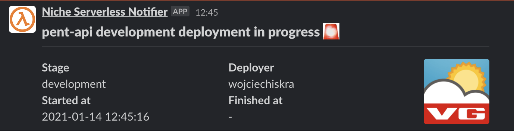
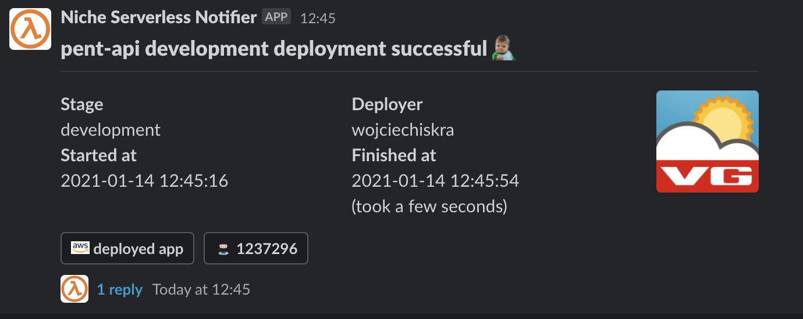
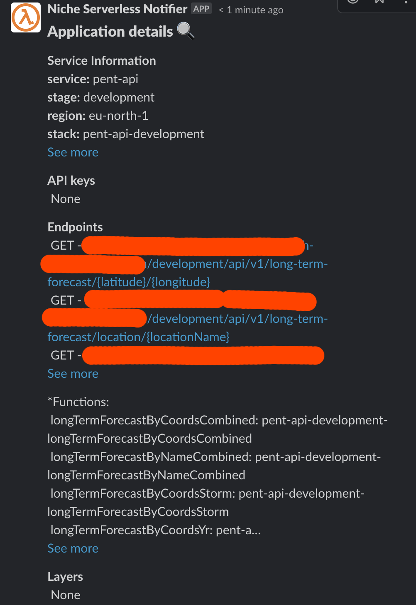

# serverless-slack-deploy-notification

# Serverless Slack deploy notification
A Serverless plugin that sends a slack message on deployment start and finish

## Demo
When deployment starts plugin posts a message like this:


When deployment finishes successfully plugin updates the first message into:


**Sadly there's no way to detect a deployment error and send a notification then. 
In that case you get stuck on the 'deployment in progress' notification**

Additionally, when the deploy finishes, plugin posts app details into a thread of the notification e.g.


## Installation
`@schibsted/serverless-slack-deploy-notification`

## Options
#### Required:
- `token` - Slack API token with at least `chat.write` scope
- `channel` - Channel ID (not channel name)

#### Optional:
- `enabled` - Turn notifications off for specific stages
- `logo` - make the notification easier to notice by putting app logo on the side of the message
- `travisUrl` - URL to your builds in Travis
- `githubUrl` - URL to your Github repository
- `appUrl` - URL where the application you're deploying will be accessible

See the sample usage below.

## Usage

```yaml
service: your-service
provider:
  name: aws
  runtime: nodejs12.x

custom:
  slackDeployNotification:
    enabled:
      staging: false
    token: %SLACK_WEB_API_TOKEN
    channel: %SLACK_CHANNEL_ID
    logo: https://cdn.pixabay.com/photo/2015/12/11/11/43/google-1088004_1280.png
    travisUrl: https://travis.schibsted.io/foo/bar
    githubUrl: https://github.schibsted.io/foo/bar
    appUrl: https://google.com

plugins:
  - "@schibsted/serverless-slack-deploy-notification"

functions:
  foo:
    handler: foo.handler
```

## Contributing

Everyone is very welcome to contribute to this repository. Feel free to [raise issues](https://github.com/schibsted/serverless-slack-deploy-notification/issues) or to [submit Pull Requests](https://github.com/schibsted/serverless-slack-deploy-notification/pulls).
